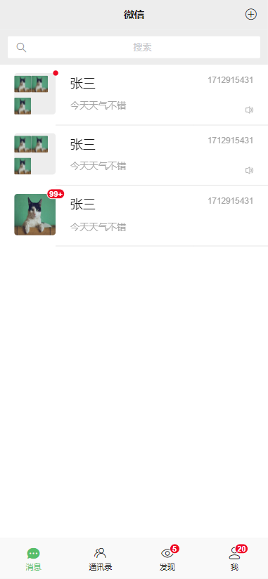
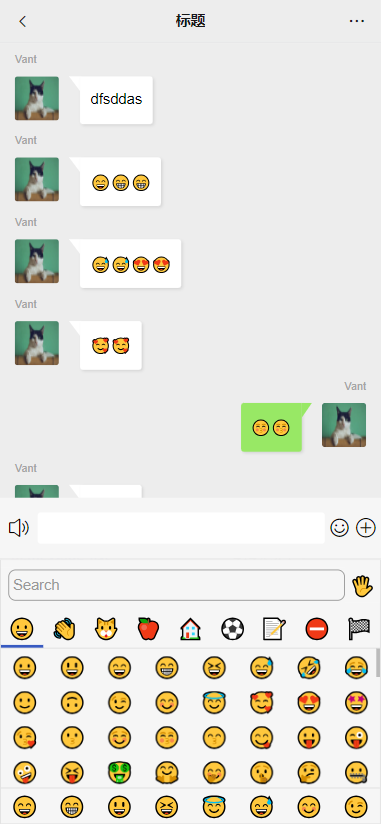
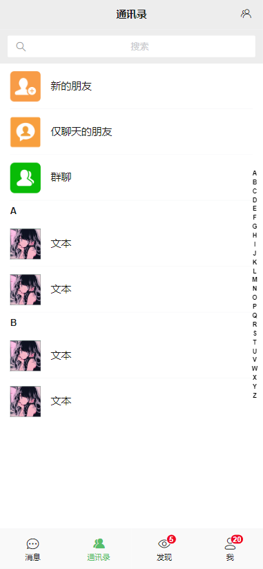

# <center>仿移动端微信web版</center>

### 项目介绍
采用前端框架vue3+vant，目前只是做了一些页面，还没做功能，会一直持续更新！！！

### 项目运行

```shell
https://github.com/Juenfy/cover-wechat-front.git
```

```shell
cd cover-wechat-front
```

```shell
npm install
```

```shell
npm run dev
```

### 项目预览
聊天列表：


聊天详情：


通讯录：


扫一扫：
<video width="1080" height="1920" controls="controls">
<source src="public/preview/qrcode-scan.mp4" type="video/mp4">
</video>


